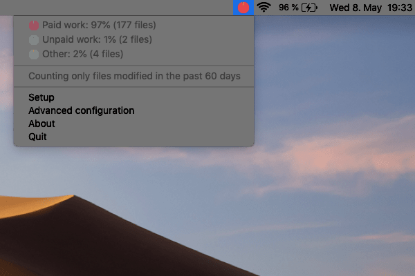
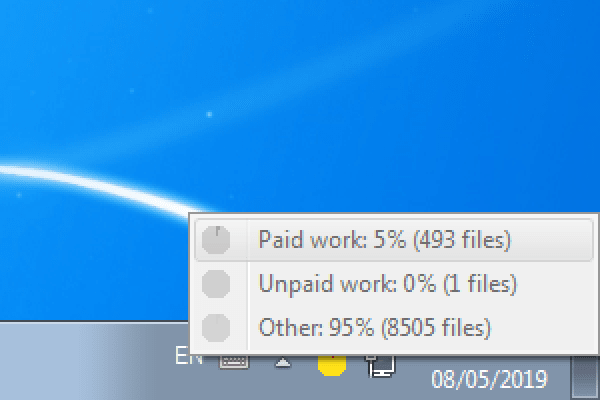
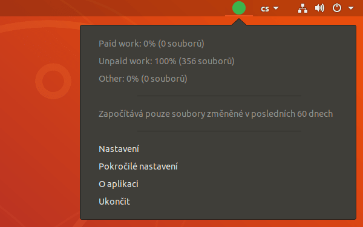
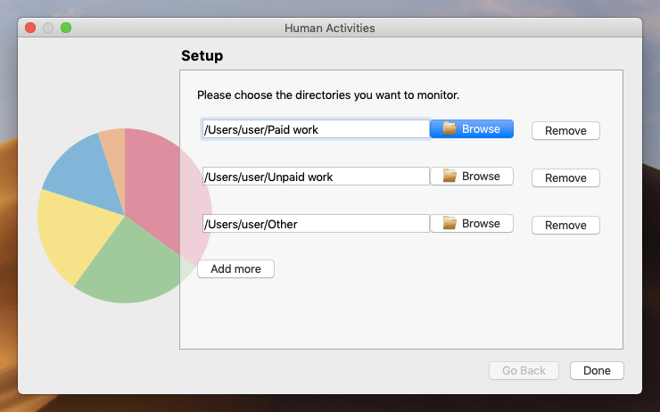
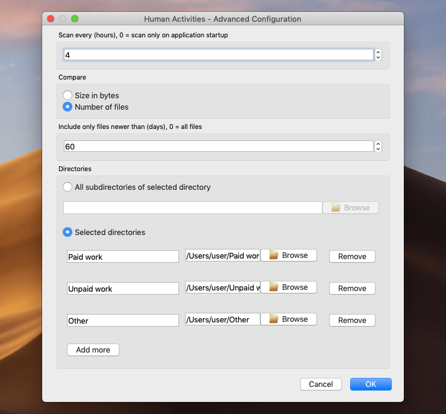

Human Activities
================

*monitor size of directories*

Human Activities is an application that displays a **pie chart icon** in the
Windows Taskbar, macOS Menu Bar or Linux System Tray. The icon shows ratio
between the number of files in configured directories. When clicked, a menu with
a list of the directories and the exact number of files appears.

The application can be **configured** to compare the size of the data in the
directories instead of the number of files in them. It can also be configured to
only count files that are newer than specified number of days.

Human Activities is an **offline** application. It doesn't send any data over the
internet.

The Human Activities project
----------------------------

This application is part of the `Human Activities`_ project which focuses on
limiting the exploitation of individuals as part of contemporary production
relationships. Read more about the project on its `website <Human
Activities_>`_.

The Human Activities project was partially **financed by** `The Foundation for
Contemporary Arts Prague`_.

Installation
------------

Windows 7 and 8
^^^^^^^^^^^^^^^

1. Download and open `Human_Activities-win7.exe`_. The app will start
   immediately. No installation process is required.
2. To launch the application automatically each time you start the computer,
   copy ``Human_Activities-win7.exe`` into the *Startup* folder of the Start Menu.
3. To make sure that the application icon is always visible:

   a) Click the arrow icon in the Taskbar and select *Customize*.
   b) In the window that opens up, choose *Show icon and notifications* next to
      the item *Human Activities*.

Security
""""""""

Before opening `Human_Activities-win7.exe`_, you can check the sha256 checksum
of this file:

::

   163cd2a044c4e0565e1a99902163277fc31f6dd8ebaa950c0a5d978a9d00c60b  Human_Activities-win7.exe

Windows 10
^^^^^^^^^^

1. Download and open `Human_Activities-win10.exe`_. The app will start
   immediately. No installation process is required.
2. To launch the application automatically each time you start the computer:

   a) Press ``WIN+R``. In the window that pops up, write the command
      ``shell:startup`` and click OK.
   b) Then move ``Human_Activities-win10.exe`` to the window that opens up.

3. To make sure that the application icon is always visible:

   a) Click on the arrow icon (*Show Hidden Icons*) in the Taskbar and select *Taskbar Settings*.
   b) In the window that opens up, click on *Select which icons appear on the
      Taskbar* and then switch item *Human Acitivities* on.

Security
""""""""

Before opening `Human_Activities-win10.exe`_, you can check the sha256 checksum
of this file:

::

   b9d6bb85d38f3faaa1ca88873463292680275663a6fb2fde40d1532c9b3e8a06  Human_Activities-win10.exe

macOS
^^^^^

Requires macOS Mojave or newer. Tested on macOS Mojave.

1. Download `Human_Activities-0.11.1.zip`_ and open it.
2. Move the file ``Human Activities.app`` to *Applications*.
3. Human Activities can now be started from *Launcher*.
4. To launch the application automatically each time you start the computer:

   a) Open *System Preferences* > *Users & Groups*.
   b) Click on the tab *Login Items*,
   c) Click on the little plus sign icon and select the app *Human Activities*.

Security
""""""""

Before opening `Human_Activities-0.11.1.zip`_, you can check the sha256 checksum
of this file:

::

   864fbb0b7dc7e1f131470587bd1b733b21a924ad1cfcf71a5dd687c3ff8d2958  Human_Activities-0.11.1.zip

Ubuntu
^^^^^^

Tested on Ubuntu 18.04 LTS and 19.10.

1. Download and open `human-activities_0.11.1-2_all.deb`_.
2. Click the button *Install* in the window that opens up.
3. Human Acitivies can now be started from the main *Applications* menu. It will
   also start automatically each time you start the computer.

Security
""""""""

Before installing the package, you can verify its GPG signature:

::

   $ gpg --recv-key 11E74F7E
   $ dpkg-sig --verify human-activities_0.11.1-2_all.deb
   Processing human-activities_0.11.1-2_all.deb...
   GOODSIG _gpgbuilder E7582303262850695EF0B8A797C3CB6A11E74F7E 1580146502

Arch Linux
^^^^^^^^^^

Build the package from provided `PKGBUILD`_ or download
`human-activities-0.11.1-2-any.pkg.tar.xz`_ and install it with pacman.

Usage
-----

Setup
^^^^^

When Human Activities is started for the first time, it will show a **setup
window** (this might take a few seconds).

Here you can choose which directories to monitor. You can only **choose existing
directories**. The app doesn't create any new directories itself. When you
remove a directory, it will be removed only from the app, your files will stay on
the disk. Human Activities never creates, modifies or deletes any files.

Icon and menu
^^^^^^^^^^^^^

When the setup is finished, Human Activities shows a **pie chart** icon with
ratio between the number of files in the directories configured in the
setup. The **colors** are assigned to the directories automatically.

When you click the icon you can see a **menu** with the exact number of files in
the directories and the exact percentages.

You can also see a note that **only files modified in the past 30 days** are
counted to the size of a directory. This behavior can be changed in the
*Advanced configuration*.

From the menu, you can also reach the *Setup* (which you saw when you first
started the app) and the *Advanced configuration*. On Windows, these items are
accessible in separate menu that opens when you right-click the icon.

How the pie chart is calculated
"""""""""""""""""""""""""""""""

Let's say we chose two directories during the setup:

- ``/Users/jakub/Paid work`` which contains 15 files
- ``/Users/jakub/Unpaid work`` which contains 30 files

Then Human Activities will first calculate the **sum of the number of files in
both directories**, which is 45. This will be the **100%**. Therefore ``Paid
work`` takes 33.3% and ``Unpaid work`` takes 66.6% of the total number of
files. This percentage will then be shown as a pie chart, which is ⅓ one color
and ⅔ another color.

Advanced configuration
^^^^^^^^^^^^^^^^^^^^^^

The advanced configuration allows you to:

- **Count the size of the data in the directories instead of the number of files
  in them.**
- Change how new (in terms of modification time) the files have to be to be
  counted.
- Give custom names to the configured directories.

Ignoring files
^^^^^^^^^^^^^^

Human Activities never counts **hidden files and directories**.

Additionaly, the application ignores some **common system files and
directories** such as ``Thumbs.db`` on Windows. You can find the exact list of
ignore patterns in `human-activities.fdignore`_. (On Linux, this file is also
available at ``/etc/xdg/human-activities/human-activities.fdignore`` after the
installation of the app.)

To configure which files get ignored, copy `human-activities.fdignore`_ to
``%APPDATA%\human-activities\human-activities.fdignore`` on Windows,
``/User/NAME/Preferences/human-activities/human-activities.fdignore`` on macOS
or ``~/.config/human-activities/human-activities.fdignore`` on Linux, and edit
the file to your liking. It uses the `.gitignore`_ syntax.

Uninstallation
--------------

Windows 7 and 8
^^^^^^^^^^^^^^^

Delete ``Human_Activities-win7.exe`` from the *Startup* folder of the Start Menu.

Windows 10
^^^^^^^^^^

1. Press ``WIN+R``. In the window that pops up, write the command
   ``shell:startup`` and click OK.
2. Then delete ``Human_Activities-win10.exe`` from the window that opens up.

macOS
^^^^^

Delete ``Human Activities.app`` from the *Applications* folder.

Ubuntu
^^^^^^

1. Open *Ubuntu Software* and click on the tab *Installed*.
2. Scroll to *Human Activities* and click the button *Remove*.

Arch Linux
^^^^^^^^^^

Uninstall the package ``human-activities`` using pacman.

Support and help
----------------

Please use `GitHub Issues`_.

Development
-----------

Building and running from source
^^^^^^^^^^^^^^^^^^^^^^^^^^^^^^^^

Windows
"""""""

::

   $ pip install Pillow sqlalchemy wxpython
   $ python -m human_activities --verbose

Mac
"""

::

   $ pip3 install Pillow sqlalchemy PyQt5
   $ python3 -m human_activities --verbose

Arch Linux
""""""""""

::

   # pacman -S pipenv python-wxpython
   $ make setup
   $ make run-debug

Creating distribution packages
^^^^^^^^^^^^^^^^^^^^^^^^^^^^^^

Windows 7 and 8
"""""""""""""""

::

   $ pip install Pillow sqlalchemy wxpython
   $ pip install pyinstaller
   $ win7/pyinstaller.cmd

Windows 10
""""""""""

::

   $ pip install Pillow sqlalchemy wxpython
   $ pip install pyinstaller
   $ win10/pyinstaller.cmd

Mac
"""

::

   $ pip3 install Pillow sqlalchemy PyQt5
   $ pip3 install pyinstaller
   $ make dist-mac

Debian
""""""

Install Docker and start it. Then run:

::

   $ make dist-debian-build dist-debian

Additionally, you can sign the created package with GPG:

::

   $ make dist-debian-sign key_id='<gpg key fingerprint>'

Arch Linux
""""""""""

::

   $ make dist-arch-linux

Notice that the package is not built from the currently checked out revision,
but from a git tag specified as ``v`` + Makefile variable ``_version``.

Translation
^^^^^^^^^^^

Edit the ``lang/*.po`` files and then run::

   $ make clean-lang gen-lang

Testing and linting
^^^^^^^^^^^^^^^^^^^

::

   $ make test
   $ make lint

Contributing
------------

**Feel free to remix this project** under the terms of the GNU General Public
License version 3 or later. See `COPYING`_ and `NOTICE`_.

.. _Human Activities: http://humanactivities.cz/
.. _The Foundation for Contemporary Arts Prague: https://fca.fcca.cz/en/news/
.. _Human_Activities-win7.exe: https://github.com/jakubvalenta/human-activities/releases/download/v0.11.1/Human_Activities-win7.exe
.. _Human_Activities-win10.exe: https://github.com/jakubvalenta/human-activities/releases/download/v0.11.1/Human_Activities-win10.exe
.. _Human_Activities-0.11.1.zip: https://github.com/jakubvalenta/human-activities/releases/download/v0.11.1/Human_Activities-0.11.1.zip
.. _human-activities_0.11.1-2_all.deb: https://github.com/jakubvalenta/human-activities/releases/download/v0.11.1/human-activities_0.11.1-2_all.deb
.. _human-activities-0.11.1-2-any.pkg.tar.xz: https://github.com/jakubvalenta/human-activities/releases/download/v0.11.1/human-activities-0.11.1-2-any.pkg.tar.xz
.. _GitHub Issues: https://github.com/jakubvalenta/human-activities/issues
.. _COPYING: ./COPYING
.. _NOTICE: ./NOTICE
.. _PKGBUILD: ./arch_linux/PKGBUILD
.. _human-activities.fdignore: ./human_activities/etc/human-activities.fdignore
.. _.gitignore: https://git-scm.com/docs/gitignore
